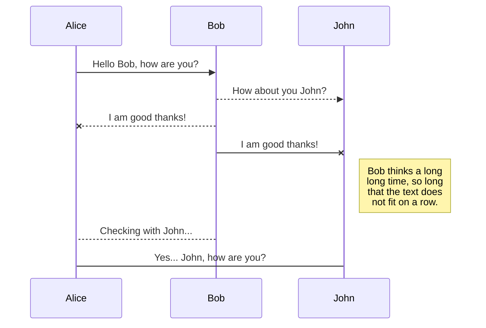
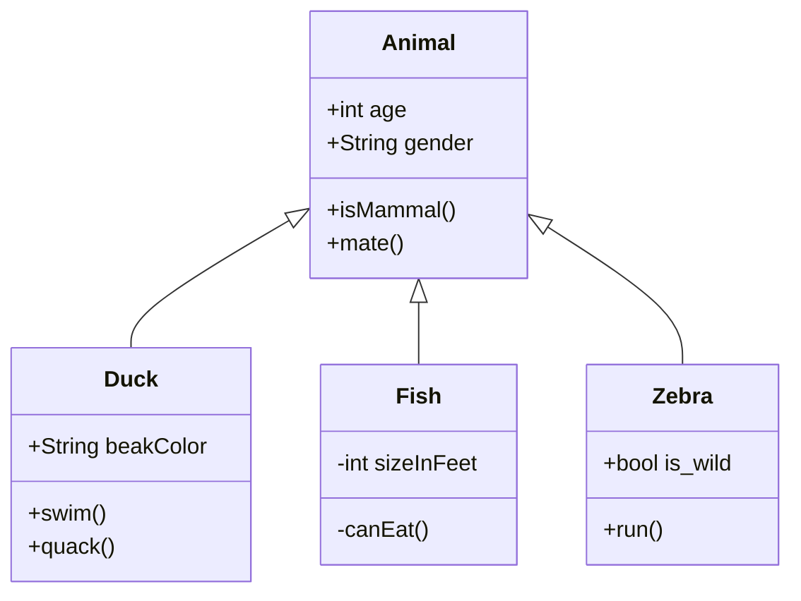
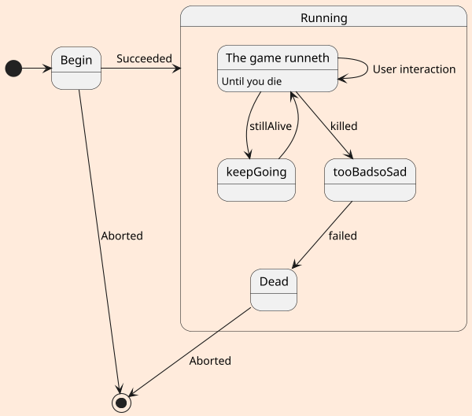
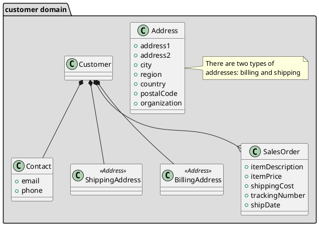

# How To Write in Markdown language

## Tools
### Mermaid
* https://mermaid-js.github.io/mermaid/#/

* You can easily intall mermaid at the extension tap

* Sequence Diagram

* class diagram

### PlantUML

https://www.freecodecamp.org/news/inserting-uml-in-markdown-using-vscode/

#### State Diagram

#### Class Diagram

